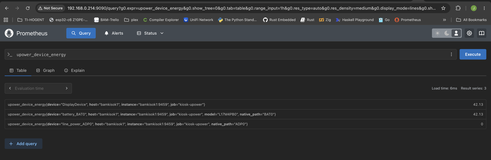
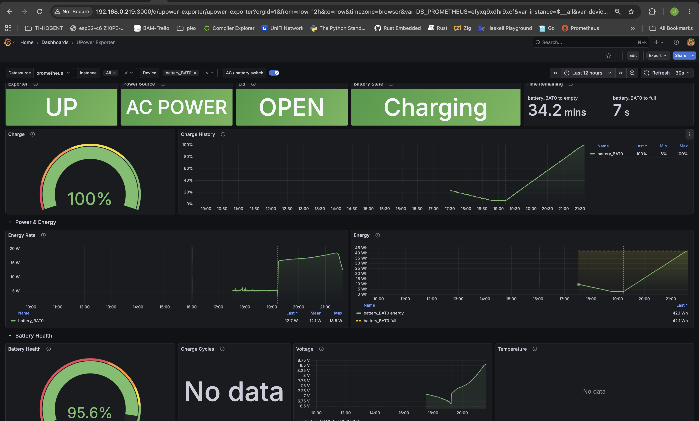
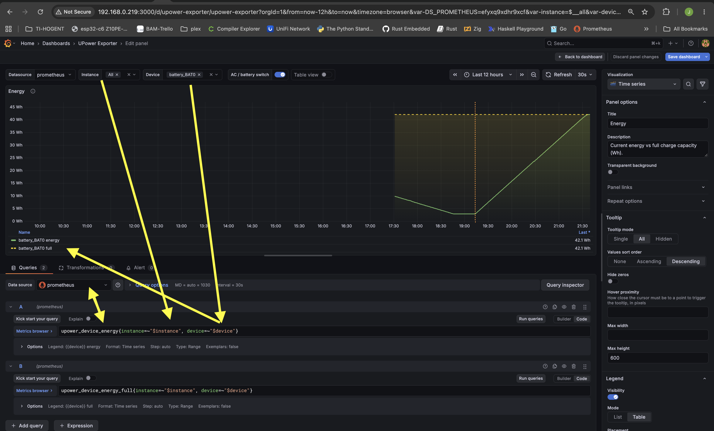

# upower-exporter

Een kleine Prometheus exporter die power metrics (batterij, lichtnet, draadloze muizen, ...) uitleest via UPower en beschikbaar stelt op `/metrics`. Elke keer dat Prometheus komt scrapen, vraagt de exporter alles vers op via D-Bus — geen caching, geen gedoe.

## resultaat in grafana

<p align="center">
  
</p>

<p align="center">
  
</p>

<p align="center">
  
</p>


## Wat doet dit eigenlijk?

Op Linux weet de kernel perfect hoe je batterij eraan toe is, en "_alles is een file_":

```sh
$ cat /sys/class/power_supply/BAT0/energy_now
41450000
$ upower -i $(upower -e | grep battery)
  native-path:          BAT0
  vendor:               SMP
  model:                L17M4PB0
  serial:               28
  power supply:         yes
  updated:              Mon 21 Sep 2026 09:32:27 PM CEST (18 seconds ago)
  has history:          yes
  has statistics:       yes
  battery
    present:             yes
    rechargeable:        yes
    state:               charging
    warning-level:       none
    energy:              41.45 Wh
    energy-empty:        0 Wh
    energy-full:         42.13 Wh
    energy-full-design:  44.08 Wh
    energy-rate:         15.881 W
    voltage:             8.552 V
    charge-cycles:       N/A
    time to full:        2.6 minutes
    percentage:          98%
    capacity:            95.5762%
    technology:          lithium-ion
    icon-name:          'battery-full-charging-symbolic'
  History (charge):
    1790019117  98.000  charging
  History (rate):
    1790019147  15.881  charging
    1790019117  16.219  charging
    1790019086  16.532  charging
    1790019056  16.875  charging

$
```

Dat is de huidige energie in µWh (microwattuur), dus 41,45 Wh. UPower leest diezelfde files uit, rekent dat om naar deftige eenheden, en zet het op de system D-Bus. Onze exporter pikt dat daar op en maakt er een Prometheus metric van:

```

# HELP upower_device_energy UPower device property Energy.
# TYPE upower_device_energy gauge
upower_device_energy{device="battery_BAT0",model="DELL 1VX1H97",native_path="BAT0"} 41.85
```

En zo voor *alle* numerieke properties: percentage, energy_rate (watt), voltage, temperature, time_to_empty, state, enzovoort. Je moet zelf niets configureren — alles wat UPower kent, komt erin.

## Gebruiken

```sh
# statische linux binary in bin/, kan makkelijker als je go-task gebruikt (zie Taskfile.yml)
CGO_ENABLED=0 GOOS=linux GOARCH=amd64 go build -trimpath -ldflags="-s -w" -o bin/upower-exporter .

scp bin/upower-exporter je-machine:
./upower-exporter                   # luistert op :9459
curl localhost:9459/metrics
```

Er zit ook een [systemd unit](upower-exporter.service) en een [Grafana dashboard](grafana-dashboard.json) bij.

## Hetzelfde, maar simpel in Python met FastAPI

Om te tonen dat er geen magie aan te pas komt: hieronder het simpelste equivalent. We lezen gewoon dezelfde sysfs file uit en serveren die in Prometheus text formaat:

```python
from pathlib import Path

from fastapi import FastAPI
from fastapi.responses import PlainTextResponse

app = FastAPI()

@app.get("/metrics", response_class=PlainTextResponse)
def metrics() -> str:
    # µWh -> Wh, net zoals UPower dat doet
    energy_now = int(Path("/sys/class/power_supply/BAT0/energy_now").read_text()) / 1_000_000
    return (
        "# HELP upower_device_energy Huidige energie van de batterij in Wh.\n"
        "# TYPE upower_device_energy gauge\n"
        f'upower_device_energy{{device="battery_BAT0"}} {energy_now}\n'
    )
```

Draaien:

```sh
uv run --with fastapi,uvicorn uvicorn main:app --port 9459
curl localhost:9459/metrics
```

Dat werkt, maar je ziet meteen waarom de Go-versie handiger is: die ene metric hierboven is hard gecodeerd, terwijl de echte exporter automatisch *alle* devices (ook je bluetooth toetsenbord) en *alle* properties meepakt via UPower, plus deftige labels — en het is één statische binary zonder Python runtime op je server.
